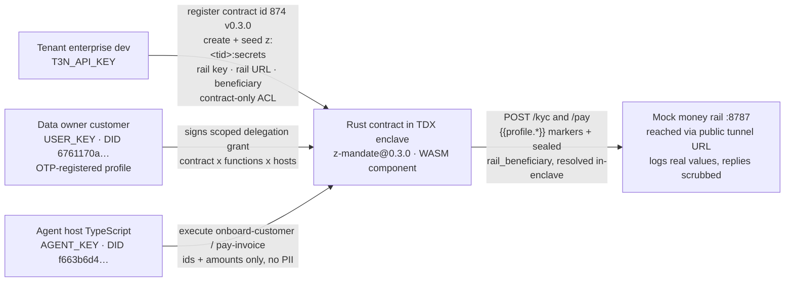

# MANDATE

**An enterprise agent that onboards a customer (KYC) and executes their first payment — without the agent, the LLM, the developer, or the app server ever seeing the identity or the bank details.** Built on the Terminal 3 (T3N) ADK for the Superteam *t3n-agent-build-challenge* ("build a trusted agent with T3N that we can distribute / host").

Plain-text status (no badges, no shields — just facts, 2026-09-03):

- **Code + docs complete.** Contract registered on **testnet** as contract id **874** — `z:8e3547bce411fd4f51fe1f25df033d83acccc869:mandate-contracts` v0.3.0 (version chain 0.1.0 → 0.2.0 → 0.3.0, ids 862 → 873 → 874).
- **All local suites green:** contract **21/21**, host **53/53**, mock-rail **12/12** (run with port 8787 free — see *Testing*), e2e assertion harness **30/30**.
- **Live demo verified 2026-09-03:** the full kyc + pay testnet run went green **twice** — Beats 0–5 exit 0 with **16 PASS each** — once the data-owner DID was email-OTP-registered with a schema-backed profile and the mock rail was exposed at a public URL (the enclave runs on the T3N node and cannot egress to loopback). The dry-run demo (`DEMO_DRY=1`) needs no network or keys. Screenshot frames are planned below, not faked.

---

## Why MANDATE

The T3N docs are blunt about the breach framing for payroll-style agents: *AI agents must not be given direct access to employee PII, bank account details, payroll provider credentials, or treasury payment keys.* Most "agentic payments" demos hand the agent exactly those secrets and hope the prompt holds. That is not a security boundary — a prompt is not a permission.

Two T3N primitives make a real boundary possible:

1. **`http-with-placeholders` + sealed config — move data without holding it.** Person data travels as schema-backed `{{profile.<field>}}` markers (`first_name`, `last_name`, `date_of_birth`, `verified_contacts.email.value`); the enclave (Intel TDX · Wasmtime) substitutes the *calling user's* real profile values from its own protected memory at the last instant before egress. Bank details never ride in any call: the beneficiary config is sealed once into `z:<tid>:secrets` (`rail_beneficiary`) and read inside the enclave at call time — the docs' own payroll model. Profile PII never crosses the WASM boundary outward (marker substitution happens host-side, inside the enclave), and the sealed bank config never leaves the TEE.
2. **Delegation instead of blanket trust.** The agent runs under a user-signed grant scoped three ways — contract × functions × egress hosts — and revocation is enforced at egress on the next call, not "please stop".

MANDATE is the smallest honest demo of that story: an onboarding + first-payment flow where the rail (the legitimate counterparty) receives the real IBAN, while the agent's own logs show only profile markers, the name of the sealed beneficiary source, and a sha-256 receipt — and a digest proof binds the two views to the same payment.

---

## How it works

Four actors plus the rail:



Plain-ASCII fallback:

```
Tenant ──register + seed rail_api_key / rail_url / rail_beneficiary into z:<tid>:secrets (readers/writers = {only:[contractId]})──▶ TEE
Agent ──execute onboard-customer / pay-invoice (customer_id / invoice_id / amount only)────────────▶ TEE
User ──OTP-registered profile + signs member-delegation BoundGrant (functions + allowedHosts)─────────▶ TEE
TEE (TDX enclave) ──POST {RAIL}/kyc, {RAIL}/pay: person {{profile.*}} markers + sealed rail_beneficiary, resolved in-enclave──▶ Mock rail
Mock rail ──writes real payload to rail.log; returns scrubbed verdicts (never echoes PII)───────────▶ TEE
```

**Who never sees what:**

| Actor | Handles | Never sees |
|---|---|---|
| Agent host / LLM | ids (`cus_1`, `inv_1`), amounts, markers, verdicts | identity or bank plaintext — its call payloads and its log carry `{{profile.*}}` markers, the sealed-`rail_beneficiary` name, and `iban_sha256` only |
| Developer / app server | keys, deploy, logs | the demo IBAN never appears in non-test code (asserted by `e2e_assert_repo_no_plaintext_iban`); it lives only in the gitignored `host/.env` seed and the rail's log |
| Contract (WASM) | builds marker bodies, reads the sealed beneficiary via `kv-store`, parses scrubbed verdicts | person PII — profile markers are substituted host-side inside the enclave at egress, never in WASM |
| T3N enclave host | resolves profile markers at egress; enforces grant + audit | nothing — it is the substitution point, and it is what the user's grant constrains |
| Money rail | the real values (it is the counterparty) | cannot reflect them back — responses are scrubbed, plus a one-way `iban_sha256` proof |

The contract's capability surface is the four WIT imports in `contract/wit/world.wit` (`z:mandate@0.3.0`): `tenant-context@1.0.0` and `logging` / `kv-store` / `http-with-placeholders@2.1.0`. Deliberately no plain `http` import — every outbound MANDATE call carries either schema-backed person markers (KYC fields, pay `customer_email`) or beneficiary config read from the sealed KV secret at call time (`/pay`).

---

## Safety rails

Each property, where it is enforced, and the test that proves it:

| Privacy property | Enforced in | Proof (test / assert) |
|---|---|---|
| Inputs reject inline PII | `#[serde(deny_unknown_fields)]` on `KycReq` / `PayReq` (`contract/src/kyc.rs`, `contract/src/pay.rs`) — a would-be `iban` or `legal_name` in the input is a hard parse error | `onboard_customer_rejects_inline_pii`, `pay_invoice_rejects_inline_pii` |
| Outbound bodies carry markers or sealed config only | person markers are the `MARKER_*` consts in `contract/src/lib.rs` (`first_name`, `last_name`, `date_of_birth`, `verified_contacts.email.value`); the `/pay` beneficiary object is read from the sealed `rail_beneficiary` KV secret inside the enclave, never from the request or the host; `PAY_BODY_TEMPLATE` in `host/src/run-demo.ts` mirrors the shape descriptively | `build_kyc_body_is_markers_only` (asserts no `GB29`, no literal name/dob, and no bank markers in KYC), `build_pay_body_carries_sealed_beneficiary_and_email_marker_only` |
| Verdicts are scrubbed allowlists | `KycVerdict {kyc_id, status, risk_score?}` / `PayVerdict {payment_id, status, iban_sha256}` parse rail JSON and drop every other key | `parse_kyc_verdict_ok_and_scrubbed` (`checks` dropped), `parse_pay_verdict_ok_and_scrubbed` (`trace` dropped) |
| Rail body never in errors or logs | errors carry the HTTP code only — a deliberate deviation from the Duffel reference (`contract/src/kyc.rs`, `contract/src/pay.rs`); contract logs name only the operational id | code comments + wasm-path review; demo Beat 2 asserts the agent log has no resolvable IBAN fragment (`GB29 NWBK`) |
| Size guards both directions | `MAX_INPUT_BYTES` / `MAX_RESP_BYTES` = 65 536 (`contract/src/lib.rs`) | `*_rejects_oversized_input` unit tests |
| Agent-side ledger is markers-only | `host/src/lib/logger.ts` appends what the agent observed to `host/agent-output.log` (gitignored) | demo Beat 2: `e2e_assert_file_contains '{{profile.verified_contacts.email.value}}'` and `'rail_beneficiary'`, plus `e2e_assert_file_not_contains 'GB29 NWBK'` |
| Repo carries no plaintext IBAN | the demo IBAN is never hardcoded in source — it is seeded once via the gitignored `host/.env` (`RAIL_BENEFICIARY`; canonical fixture lives in the exempt `tests/e2e-asserts.sh`) and re-hashed from `rail.log` at runtime | demo Beats 0 and 5: `e2e_assert_repo_no_plaintext_iban` (harness: `tests/e2e-asserts.test.sh`, 30 cases) |
| Rail secrets are sealed, not shared | `rail_api_key`, `rail_url` and `rail_beneficiary` live only in `z:<tid>:secrets` with `readers/writers: {only:[contractId]}`, seeded via the control plane from `RAIL_API_KEY` / `RAIL_URL` / `RAIL_BENEFICIARY` (`host/src/register.ts`) and read inside the enclave at call time | `host/tests/register.test.ts` |
| Egress is scoped and revocable | user-signed `member-delegation` BoundGrant: contract × functions × `allowed_hosts` (`host/src/grant.ts`); revocation empties the document | demo Beats 3–4: after `grant revoke`, pay exits non-zero with `egress denied` and `rail.log` line count is unchanged |

---

## Repository layout

```
terminal3/
├── README.md  LICENSE (MIT)  .gitignore
├── contract/     Rust TEE contract → WASM component (~171 KB)
│                 Cargo.toml · .cargo/config.toml · src/{lib,kyc,pay}.rs
│                 wit/world.wit · wit/deps/ (host-interfaces 2.1.0 · host-tenant 1.0.0, pinned)
├── host/         TypeScript agent host (@terminal3/t3n-sdk 5.5.0)
│                 package.json · tsconfig · .env.example
│                 src/{connect,register,grant,run-demo}.ts · src/lib/{env,records,logger,rail-client}.ts
│                 tests/ (grant · register · run-demo-modes)
├── mock-rail/    Express mock money rail (:8787)
│                 src/{app,server,rail-log}.ts · tests/
├── scripts/      build-contract.sh · start-rail.sh · demo.sh · README.md
├── tests/        e2e-asserts.sh (assertion library) · e2e-asserts.test.sh (30-case harness)
├── docs/         ARCHITECTURE.md · SUBMISSION.md · buglog.md · research/
└── implementation.md   internal build notes (research + decisions D1/D2; not part of the demo)
```

- [docs/ARCHITECTURE.md](docs/ARCHITECTURE.md) — deep dive: data flow, threat model, decision log.
- [docs/SUBMISSION.md](docs/SUBMISSION.md) — the bounty submission package (Google Doc text, screenshot index, bug-report summary).
- [docs/buglog.md](docs/buglog.md) — verbatim live-testnet findings BUG-001…009 (a scored artifact in its own right).
- [docs/BUG-REPORTS.md](docs/BUG-REPORTS.md) — formalized, submission-grade bug reports (R01–R14, severity matrix, clean-state reproductions).

---

## Run it yourself

**Prereqs:** Node ≥ 18 + npm, Rust stable (`rustup`), and a public-tunnel tool for the live rail (`cloudflared`, or `serveo`/`localhost.run` via ssh). The `wasm32-wasip2` target is added automatically by the build script; the wasm build needs **no MSVC linker** (bundled `wasm-ld`). Testnet keys from the claim page.

**The five steps** (from a fresh clone — every command is copy-paste verified; the full sequence ran green **twice** on testnet 2026-09-03):

```bash
# 1. Install host + mock-rail dependencies
(cd host && npm install)
(cd mock-rail && npm install)

# 2. Build the Rust contract to a WASM component
bash scripts/build-contract.sh          # → contract/target/wasm32-wasip2/release/z_mandate.wasm (~171 KB)

# 3. Start the mock money rail and expose it at a PUBLIC URL — two terminals
bash scripts/start-rail.sh              # http://localhost:8787 · endpoints GET /health, POST /kyc, POST /pay
cloudflared tunnel --url http://localhost:8787
#   → prints a public https URL, e.g. https://xxxx.trycloudflare.com  (or: ssh -R 80:localhost:8787 serveo.net)
#   The enclave runs on the T3N node — it can never reach your machine's loopback,
#   so LIVE runs need the rail tunneled. Local unit runs keep http://localhost:8787.

# 4. Point the host at testnet
cp host/.env.example host/.env          # then fill in the keys + rail vars (see below)
(cd host && npm run register)           # register z-mandate + seed rail_api_key / rail_url / rail_beneficiary into z:<tid>:secrets → host/.contract-record.json
(cd host && npm run grant -- grant)     # data-owner user signs the delegation grant (contract × functions × allowedHosts derived from RAIL_URL)

# 5. Run the demo — live, or dry (no network, no keys needed)
bash scripts/demo.sh                    # Beats 0–5 with self-asserting checks (live: exit 0, 16 PASS each run)
DEMO_DRY=1 bash scripts/demo.sh         # print the full trace, execute nothing
# …or drive the two functions directly:
(cd host && npx tsx src/run-demo.ts all)          # kyc then pay (+ magic-moment + audit panes)
(cd host && npx tsx src/run-demo.ts kyc --customer cus_1)
(cd host && npx tsx src/run-demo.ts pay --invoice inv_1 --amount 199.00)
```

**Filling `host/.env`:** claim three keys at <https://www.terminal3.io/claim-page> — `T3N_API_KEY` (tenant), `AGENT_KEY` (agent), `USER_KEY` (data owner). Claim them as **distinct identities** (BUG-003: keys claimed under one account collapse to one DID). Then set the three rail variables:

- `RAIL_URL` — the **public** rail URL for live runs (`https://xxxx.trycloudflare.com`); `http://localhost:8787` is fine for local unit runs only. `register` seeds it into `z:<tid>:secrets` as `rail_url`; the contract resolves its egress target from that secret at call time.
- `RAIL_BENEFICIARY` — the sealed payment config as a JSON string, e.g. `{"legal_name":"Ada Bank","iban":"GB29 NWBK 6016 1331 9268 19","swift":"NWBKGB2L"}`. `register` seeds it verbatim as `rail_beneficiary`; the contract reads it inside the enclave and it never appears anywhere else (host/.env is gitignored).
- `RAIL_API_KEY` — any non-empty secret; seeded as `rail_api_key` and presented to the rail as an `Authorization` header on egress (the mock rail records the header but does not enforce auth — the point is proving the credential path).

`register` seeds all three secrets via the control plane with contract-only readers/writers, and `grant -- grant` derives `allowedHosts` from `RAIL_URL`'s host automatically. Agent and user DIDs start at **zero credits** (metered ops ≈ 1e10 each — see BUG-004); top up by messaging `t.me/wardumb`, quoting "Superteam" + your DID.

**The data-owner must be a real registered user with a profile.** The `{{profile.*}}` markers resolve against the *subject user's* profile (the one `run-demo.ts` binds as `pii_did` on every execute), so a bare claim-page `USER_KEY` is not enough: the user has to complete email-OTP registration and a profile upsert on testnet — the SDK's `otpRequest` → `otpVerify` (binds the verified email as `verified_contacts.email.value`) → `submitUserInput` (first/last name, date of birth) flow. The 2026-09-03 live demo's user (`did:t3n:6761170a…`, profile "Ada Bank", DOB 1990-01-15) was registered this way via an OTP-bound disposable mailbox. Bank fields are *not* profile fields — see the deviations section for where they live.

**Testing** (local suites need no testnet; the demo row is the live testnet run):

| Suite | Command (repo root unless noted) | Result |
|---|---|---|
| Contract units | `(cd contract && cargo test --target x86_64-pc-windows-gnu --lib)` | 21/21 — 10 kyc + 9 pay + 2 lib |
| Host units | `(cd host && npx vitest run)` | 53/53 — 16 grant + 15 register + 19 run-demo + 3 run-demo-modes |
| Host typecheck | `(cd host && npx tsc --noEmit)` | clean |
| Mock-rail units | `(cd mock-rail && npx vitest run)` | 12/12 — run with port 8787 **free** (one case asserts that importing `server.ts` binds nothing; stop a running rail first) |
| Mock-rail typecheck | `(cd mock-rail && npx tsc --noEmit)` | clean |
| e2e assertion harness | `bash tests/e2e-asserts.test.sh` | 30/30 |
| **Demo — live testnet** | rail tunneled to a public URL; user OTP-registered with a profile; `bash scripts/demo.sh` | **exit 0 twice** — Beats 0–5, **16 PASS each** (2026-09-03) |

The explicit `--target` override on the contract test is required: `contract/.cargo/config.toml` defaults the build target to `wasm32-wasip2`. On macOS/Linux substitute your host triple (e.g. `x86_64-unknown-linux-gnu`).

**Where the logs land** (both gitignored, both local):

- `host/agent-output.log` — the **agent's view**: markers literal (`{{profile.verified_contacts.email.value}}`), the sealed-`rail_beneficiary` source name, `iban_sha256` — never resolved values.
- `mock-rail/rail.log` — the **rail's view**: the exact payloads it received, resolved values included.

---

## The demo

`scripts/demo.sh` runs six self-asserting beats:

| Beat | Step | Asserts |
|---|---|---|
| 0 · BEFORE | pre-flight | repo carries no plaintext IBAN; rail `/health` answers; `.env` + `.contract-record.json` present |
| 1 · KYC | `onboard cus_1` | agent log shows the `{{profile.*}}` markers; rail.log gets the real customer record |
| 2 · PAY | `pay inv_1 199.00` — **the magic moment** | agent log has the `{{profile.verified_contacts.email.value}}` marker and the sealed-`rail_beneficiary` source — and *not* `GB29 NWBK`; rail.log grows exactly one `/pay` line; `sha256(IBAN from rail.log) == iban_sha256 in agent log` |
| 3 · REVOKE | `grant -- revoke` | delegation document emptied (legacy + modern surfaces) |
| 4 · DENIED | `pay inv_2 50.00` again | exits non-zero with `egress denied`; rail.log line count unchanged — the call never reached the rail |
| 5 · AFTER | invariants | repo still carries no plaintext IBAN; summary of where to look |

**The magic moment.** One request, two views. The agent's `pay-invoice` call carries no bank data at all — its outbound body pairs the payer contact as a schema-backed marker (`"customer_email":"{{profile.verified_contacts.email.value}}"`) with a beneficiary object that is read, inside the enclave, from the **sealed** `rail_beneficiary` secret in `z:<tid>:secrets` (`{"legal_name":…,"iban":…,"swift":…}` — the docs' payroll model, because the profile schema cannot carry bank fields). The `/kyc` body resolves the same way, from the schema-backed person markers `{{profile.first_name}}`, `{{profile.last_name}}`, `{{profile.date_of_birth}}`. Live on 2026-09-03 the rail received `{"customer_id":"cus_1","date_of_birth":"1990-01-15","first_name":"Ada","last_name":"Bank"}` on `/kyc`, and a `/pay` body whose beneficiary — `legal_name "Ada Bank"`, `iban "GB29 NWBK 6016 1331 9268 19"`, `swift "NWBKGB2L"` — came from the sealed secret. So `host/agent-output.log` shows only the email marker, the string `rail_beneficiary`, and a digest, while `mock-rail/rail.log` — the counterparty's own record — shows the real values the rail received. The contract returns only `{payment_id, status, iban_sha256}`, and the demo script re-hashes the IBAN it extracts from rail.log: the live run's digest `513740128f95b1e09615d6fed53bfce2a0fa0b87f782f6121bc8725ae6d5a35b` is exactly `sha256` of that IBAN string. The secret moved without touching the mover, and receipt is provable without revealing the value.

**Planned screenshot frames** — the live run these frames document went green **twice** on testnet 2026-09-03 (Beats 0–5, exit 0, 16 PASS each). Frames are the capture list below, not faked:

1. `connect` — three sessions print their DIDs (tenant / agent `f663b6d4…` / user `6761170a…`).
2. `register` — `contract registered: id=874 name=z:8e3547…:mandate-contracts v0.3.0 …` + secrets-map state (rail_api_key / rail_url / rail_beneficiary) + record saved.
3. `grant -- grant` — the signed BoundGrant summary (functions, `allowed_hosts`, both surfaces).
4. Beat 1 — KYC verdict + `agent-output.log` markers vs `rail.log` real customer record.
5. Beat 2 — the split magic-moment pane + the `sha256` proof match line.
6. Beat 3 — `grant -- revoke` output.
7. Beat 4 — the `Forbidden (agent_auth_not_found)` denial terminal (delegation revoked) + unchanged `rail.log`.
8. Beat 5 — the "repo carries no plaintext IBAN" PASS + final summary.

---

## How this is scored

Judging criteria from the Superteam listing (in order), each mapped to concrete evidence in this repo:

| # | Criterion | What MANDATE delivers | Evidence |
|---|---|---|---|
| 1 | Time to submit (earlier is better) | Full live testnet demo green twice 2026-09-03 (Beats 0–5, exit 0, 16 PASS each); build + docs finalized 2026-09-02 — 13 days before the 2026-09-16 15:59:59 UTC deadline | live run evidence: contract id 874 v0.3.0 + agent/user DIDs + rail hits, logged in [docs/buglog.md](docs/buglog.md); git history |
| 2 | Usefulness & ease to maintain — **VERY IMPORTANT** | Clone-and-run in five commands, including a no-network dry run; single swap points (`MARKER_*` consts, `RAIL_URL`/`RAIL_BASE`, the sealed `rail_beneficiary` seed); re-registration re-points map ACLs automatically; deterministic self-asserting demo (green live, not just dry); gitignored secrets/logs; no MSVC needed to build | §Run it yourself; `scripts/demo.sh` (live testnet exit 0 twice 2026-09-03; `DEMO_DRY=1` offline); `contract/src/lib.rs`; `host/src/register.ts` `ensureSecretsMap`; [docs/ARCHITECTURE.md](docs/ARCHITECTURE.md) |
| 3 | Documentation quality | Criteria-mapped README (this file), deep-dive architecture doc, submission package, verbatim bug log; every documented command copy-paste verified | this file; [docs/ARCHITECTURE.md](docs/ARCHITECTURE.md); [docs/SUBMISSION.md](docs/SUBMISSION.md) |
| 4 | Bug submission quality | 9 live-confirmed findings (BUG-001…009), each with verbatim error, reproduction, severity, status, suggested fix | [docs/BUG-REPORTS.md](docs/BUG-REPORTS.md) — formalized R01–R14 (severity matrix, clean-state reproductions); raw log: [docs/buglog.md](docs/buglog.md) |
| 5 | Bonus — X post tagging @terminal3io | a social post, not a repo artifact; checklist and planned post live in the submission package | [docs/SUBMISSION.md](docs/SUBMISSION.md) |

---

## Troubleshooting

Every row below is a real error from a real run (see [docs/buglog.md](docs/buglog.md) for full reproductions):

| Symptom | Cause | Fix |
|---|---|---|
| `T3N_API_KEY is not set — copy host/.env.example to host/.env and fill it in` | missing `host/.env` | `cp host/.env.example host/.env` and fill the three keys + `RAIL_API_KEY` |
| ``no .contract-record.json — run `npm run register` first`` | registration record missing or stale | `(cd host && npm run register)` (re-registering overwrites the record and re-points the secrets-map ACL to the new contract id) |
| `InsufficientCreditError: InsufficientCredit (account=f663b6d4005efe2ecac5a9486b5426b8499924d3, required=10000000000, available=0)` | agent/user DIDs start at zero credits; metered ops ≈ 1e10 (BUG-004, confirmed live) | top up via `t.me/wardumb` (quote "Superteam" + your DID). The legacy `agent-auth-update` write succeeds at zero credits, but the modern functional grant (`updateMemberDelegation`) and all contract executions are metered — the user DID that signs the grant needs credits too (BUG-008) |
| `contract error: onboard-customer: egress denied for host localhost` (platform: `host/http.egress_denied: host 'localhost' is not in the authorised_hosts allowlist`) | no (or revoked) delegation grant, or the grant names `localhost:8787` — hosts match **without port** | `(cd host && npm run grant -- grant)`; allowed host is `localhost`, not `localhost:8787` |
| `contract error: … user profile missing field: date_of_birth` | placeholder references a field the user's profile does not carry (BUG-006, confirmed live) | see the profile-schema caveat below — this is exactly the D1 failure mode the `MARKER_*` consts isolate |
| `rail preflight: … unreachable` / `FAIL: mock rail not reachable at http://localhost:8787` | mock rail not running | start it in a second terminal: `bash scripts/start-rail.sh` |
| `EADDRINUSE` / the rail log shows old entries when you restart it | something already listens on 8787 (or rail.log accumulates — it is append-only by design) | stop the stale process or `RAIL_PORT=8788 bash scripts/start-rail.sh` — but keep 8787 unless you rebuild the contract, whose `RAIL_BASE` const points there |
| All three claim-page keys authenticate to the same DID | claim-page keys are account-scoped (BUG-003, confirmed live) | claim the three keys as distinct identities — DIDs are never hardcoded; each session reads its own from `authenticate()` |
| `Error: Trust manifest at https://cn-api.sg.testnet.t3n.terminal3.io/api/trust-manifest is malformed.` | SDK 5.5.0 requires `rtmr1_allowlist`; testnet serves only `rtmr3_allowlist` (BUG-002, confirmed) | already handled: `host/src/connect.ts` uses the documented dev escape hatch `trustAnchor: { unsafe_trust_server: true }` — only affects you if you write your own scripts |
| ``error: linking with `link.exe` failed … extra operand`` | git-bash `link.exe` is GNU coreutils, not the MSVC linker (BUG-001; native builds only — the wasm build is unaffected) | use the GNU toolchain (`--target x86_64-pc-windows-gnu` with mingw gcc) or install the MSVC C++ Build Tools workload |
| `secrets map already exists AND its ACL could not be re-pointed … (stale)` | re-registration allocated a new contract id and the map re-point failed | rare; delete/recreate the map or use a clean tenant, then `npm run register` again |

---

## Known deviations & honest caveats

1. **Testnet-only.** Everything runs against the T3N testnet cluster (`setEnvironment("testnet")` is explicit everywhere — the docs contradict themselves on the SDK default). No production deployment is claimed.
2. **Profile-schema gap (decision D1).** `{{profile.legal_name}}`, `{{profile.iban}}`, `{{profile.swift_bic}}` are *not* in the documented profile-field list and their resolution is **UNCONFIRMED** on this cluster (`date_of_birth` already failed on the walkthrough profile, BUG-006). The `MARKER_*` consts in `contract/src/lib.rs` are the single swap point: if a marker fails to resolve at first live registration, each affected field flips to the docs' own fallback — a demo-hardcoded value supplied by the contract, the exact z-tenant-flight `passport_number` precedent — and the trade-off is documented. The swap is a const change, not a call-site change.
3. **SDK naming drift + legacy grant surface (decision D2, resolved live).** The documented legacy write (`agent-auth-update` on `tee:user/contracts`) succeeds but **no longer arms egress**; `host/src/grant.ts` writes the modern `member-delegation` BoundGrant as the functional grant and keeps the legacy write for docs parity only. Egress hosts are matched **without port** (`localhost`, not `localhost:8787`).
4. **KV maps are owner-tamperable.** The `z:<tid>:secrets` map is contract-only by ACL, but the tenant can always write via the control plane; the append-only guarantee lives in the audit ledger, not in KV. State this honestly in any enterprise pitch.
5. **The mock rail is a stand-in.** It is a config-swap counterparty in the Duffel pattern: swap `RAIL_BASE` + the rail key for a real rail and the contract logic is unchanged. It deliberately does not enforce auth — it records the `Authorization` header to prove the credential path.
6. **Trust anchor escape hatch.** Because of BUG-002 the SDK cannot verify the testnet trust manifest, so sessions use the documented `unsafe_trust_server: true` dev anchor. Revisit when the SDK accepts `rtmr3_allowlist`-only manifests.
7. **Windows/git-bash environment.** Development happened on Windows 11 in git-bash; the demo scripts are bash. The wasm build needs no MSVC, but native `cargo test` on Windows needs a working native linker (GNU or MSVC) — BUG-001 has the full fix.

---

## License & handover

**License: MIT** (see [LICENSE](LICENSE)).

To the sponsor: this repository is structured to be run and distributed after the challenge — the answer to the eligibility question *"would you want to continue running this / pass it to us to run it?"* is **continue running it**. The five-command setup, the no-network dry-run demo, gitignored secrets and logs, and the single-edit swap points (`MARKER_*` consts, `RAIL_BASE`, `PAY_BODY_TEMPLATE`) are all deliberate maintainability choices: swap the mock rail for a real one, or point the markers at documented profile fields, without touching the flow. The full story — threat model and decision log in [docs/ARCHITECTURE.md](docs/ARCHITECTURE.md), the submission package in [docs/SUBMISSION.md](docs/SUBMISSION.md), and every live platform finding in [docs/buglog.md](docs/buglog.md). Internal build notes live in `implementation.md` for reference only.
