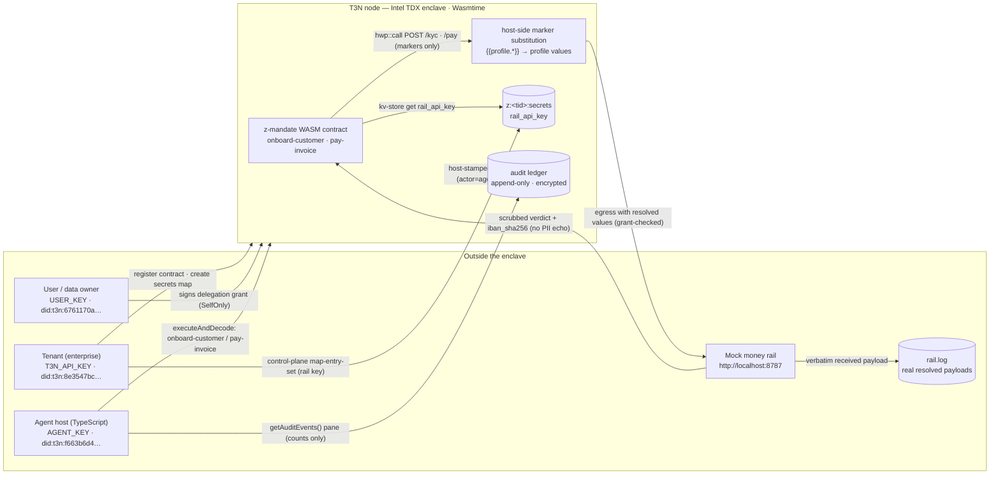

# MANDATE — Architecture & Data Flow

Deep technical companion to the [README](../README.md) and the submission write-up
([SUBMISSION.md](SUBMISSION.md)). Every interface name, field, error string, and constant
below is quoted from the committed code and vendored WIT on branch `phase-6/docs`
(live state 2026-09-02).

## 1. Overview

MANDATE is an enterprise agent built on the Terminal 3 (T3N) ADK: it onboards a customer
at a money rail (`onboard-customer`) and executes that customer's first payment
(`pay-invoice`) — while the agent host, its operator, and any log it writes never see the
customer's identity or bank details in plaintext.

The mechanism is `http-with-placeholders`: the Rust contract, compiled to a WASM
component running inside an Intel TDX enclave (Wasmtime), never receives or constructs the
plaintext. Request bodies carry only `{{profile.<field>}}` markers; the T3N host
substitutes the calling user's real profile values *inside the enclave* at egress time,
between manifest validation and the outbound HTTP call. The mock counterparty rail
therefore receives the real data, while the agent's view of the same request is markers
plus a one-way sha256 receipt (`iban_sha256`). Egress only happens under a scoped,
revocable delegation grant signed by the data owner (SelfOnly), enforced per
contract × function × host.

**Scope note.** This document describes the committed code on branch `phase-6/docs`:
the contract (`contract/`), the TypeScript host (`host/`), the mock rail (`mock-rail/`),
and the deterministic demo (`scripts/demo.sh` + `tests/e2e-asserts.sh`). Where the live
testnet registration state matters, the current record is used (contract id **862**,
canonical name `z:8e3547bce411fd4f51fe1f25df033d83acccc869:mandate-contracts`, v0.1.0).
Honest limits are itemised in §8, and the D1 marker probe is still open (§8.2).

## 2. System diagram



ASCII fallback (for viewers that do not render Mermaid):

```
Tenant (enterprise)            User / data owner
 T3N_API_KEY                   USER_KEY
 did:t3n:8e3547bc…             did:t3n:6761170a…
   │ register / seed              │ signs delegation grant (SelfOnly)
   ▼                              ▼
┌───────────────────────────────────────────────────────────────┐
│ T3N node — Intel TDX enclave · Wasmtime                        │
│                                                               │
│  z-mandate WASM  ── kv get ──▶ z:<tid>:secrets (rail_api_key) │
│  onboard-customer                                             │
│  pay-invoice     ── POST /kyc,/pay ──▶ host-side substitution │
│  (markers only,                  {{profile.*}} → real values, │
│   never plaintext)               egress grant-checked)        │
│                                                               │
│  audit ledger: append-only, encrypted, host-stamped           │
│  (subject / actor / vc_id can never be forged by the contract)│
└───────────────────────────────────────────────────────────────┘
   ▲                                    │  scrubbed verdict + iban_sha256
   │ executeAndDecode                   │  (no PII echoed back)
Agent host (TypeScript)                 ▼
 AGENT_KEY · did:t3n:f663b6d4…     Mock money rail :8787
 agent-output.log: markers only     rail.log: REAL payloads (counterparty view)
```

## 3. Actors & trust table

Live DIDs (testnet, 2026-09-02; DIDs are never hardcoded by the code — they come from
each session's `authenticate()` result and are recorded here for the submission):

| Actor | Key / identity | What it can do | What it NEVER sees |
|---|---|---|---|
| **Tenant** (enterprise operator) | `T3N_API_KEY` claim-page key · `did:t3n:8e3547bc…` | Registers the WASM component (`tenant.contracts.register`); creates the contract-only `secrets` map; seeds `rail_api_key` via control-plane `map-entry-set` (bypasses ACLs); persists `host/.contract-record.json` | The customer's profile plaintext; resolved rail payloads. It only ever ships marker templates into the contract. |
| **Agent host** (TS, SDK 5.5.0) | `AGENT_KEY` · own DID `did:t3n:f663b6d4…` · own credits (BUG-004) | `executeAndDecode` of `onboard-customer` / `pay-invoice` under the user-signed grant; writes `host/agent-output.log`; prints the "magic moment" pane and the compact audit pane | Resolved profile values. Its call payloads carry `{customer_id}` / `{invoice_id, amount}` only, never bank data; verdicts are scrubbed (`payment_id/status/iban_sha256`). |
| **User / data owner** (customer stand-in) | `USER_KEY` · `did:t3n:6761170a…` | Owns the profile the placeholders resolve from; signs the delegation grant on BOTH surfaces (legacy `tee:user/contracts` + modern `tee:authorisations/contracts`, SelfOnly); revokes with an empty doc | Rail traffic and the contract's internals. Its own audit trail (subject DID) is readable via `getAuditEvents({ pii_did })`. |
| **Contract** (`z_mandate.wasm`, in enclave) | Registered id **862** · canonical `z:8e3547bc…:mandate-contracts` · v0.1.0 | Reads `rail_api_key` from its own `z:<tid>:secrets` map; POSTs marker bodies to the rail; parses scrubbed verdicts; emits in-enclave `logging::info/error` lines with operational ids only | Plaintext profile values in its guest memory — substitution is host-side, after the body leaves WASM; it can only ever touch maps prefixed with its own tenant `<tid>` (z-namespace rule). |
| **Mock money rail** | Express app on `http://localhost:8787` (`RAIL_PORT`) | Receives the REAL resolved payload; logs it verbatim to `mock-rail/rail.log`; responds with scrubbed verdicts (`kyc_id…/status/risk_score/checks` resp. `payment_id/status/trace/iban_sha256`) | Nothing it should not — it is the legitimate counterparty. But its responses deliberately never echo `legal_name` / `date_of_birth` / `iban` / `swift` / `amount` back. |
| **Enclave host stack** (node) | — | Enforces the grant (contract × functions × hosts); resolves markers from the calling user's profile at egress; stamps audit rows (`subject/actor/vc_id`); enforces KV ACLs | The host does transiently see the plaintext at the substitution point — that is the design. It never puts it into the contract's return, the agent's logs, or (by construction) the repo. |

## 4. Lifecycle sequence

**Registration** (`host/src/register.ts`), **grant** (`host/src/grant.ts`, dual-surface,
D2), **invoke** (`host/src/run-demo.ts`), **audit read**:

```mermaid
sequenceDiagram
    autonumber
    participant T as Tenant session
    participant A as Agent session
    participant U as User session
    participant N as Node · TDX enclave
    participant R as Mock rail :8787
    participant L as Audit ledger

    Note over T,N: REGISTER (npx tsx src/register.ts)
    T->>N: contracts.register({tail:"mandate-contracts", version:"0.1.0", wasm})
    N-->>T: { contract_id: 862, name:"z:8e3547bc…:mandate-contracts" }
    T->>N: maps.create({tail:"secrets", visibility:"private", readers/writers = {only:[862]}})
    T->>N: control-plane map-entry-set: z:<tid>:secrets / rail_api_key
    T->>T: save host/.contract-record.json (record for grant + demo)

    Note over U,N: GRANT — user signs BOTH surfaces (D2)
    U->>N: legacy: tee:user/contracts agent-auth-update {agents:[{agentDid,scripts:[{scriptName,versionReq,functions,allowedHosts}]}]}  (best-effort, docs parity)
    U->>N: modern: updateMemberDelegation(BoundGrant) on tee:authorisations/contracts  (SelfOnly, metered — the functional grant)
    Note over U,N: BoundGrant { grantee: agentDid, contract_id: "z:8e3547bc…:mandate-contracts", functions: ["onboard-customer","pay-invoice"], scopes: [], version_req: "0.1.0", allowed_hosts: ["localhost"] }

    Note over A,N: ONBOARD (run-demo kyc --customer cus_1)
    A->>N: executeAndDecode onboard-customer {customer_id:"cus_1"}
    N->>N: kv get z:<tid>:secrets / rail_api_key
    N->>N: POST http://localhost:8787/kyc body {customer_id, legal_name:"{{profile.legal_name}}", date_of_birth:"{{profile.date_of_birth}}"}
    N->>R: egress — markers resolved from user profile inside enclave
    R-->>N: 200 {kyc_id:"kyc_<8hex>", status:"verified", risk_score:12, checks:[...]}
    N-->>A: {kyc_id, status, risk_score}   (checks scrubbed)
    N->>L: dispatch audit row (subject=user, actor=agent, vc_id)

    Note over A,N: PAY — the magic moment (run-demo pay --invoice inv_1 --amount 199.00)
    A->>N: executeAndDecode pay-invoice {invoice_id:"inv_1", amount:"199.00"}
    N->>N: POST http://localhost:8787/pay body {beneficiary:{legal_name:"{{profile.legal_name}}", iban:"{{profile.iban}}", swift:"{{profile.swift_bic}}"}, amount:"199.00", currency:"GBP", reference:"inv_1"}
    N->>R: egress — markers resolved; rail sees the REAL beneficiary
    R-->>N: 200 {payment_id:"pay_<8hex>", status:"settled", trace:"T3N-MANDATE-DEMO", iban_sha256: sha256(exact iban)}
    N-->>A: {payment_id, status, iban_sha256}   (trace scrubbed)
    N->>L: dispatch audit row (actor=agent, vc_id=delegation credential)
    A->>L: getAuditEvents({limit:10}) → compact pane {batches, events, actions} — never the raw page
```

**Revocation frame** (BEAT 3 → BEAT 4 of `scripts/demo.sh`):

```mermaid
sequenceDiagram
    autonumber
    participant A as Agent session
    participant U as User session
    participant N as Node · TDX enclave
    participant R as Mock rail :8787
    participant L as Audit ledger

    U->>N: legacy tee:user/contracts agent-auth-update {agents: []}   (best-effort parity)
    U->>N: modern tee:authorisations/contracts member-delegation-update {grants: [], discover_dids: []}   (full-doc empty write — the doc IS the state)
    Note over U,N: revoke leaves the agent's key untouched — access is gone

    A->>N: executeAndDecode pay-invoice {invoice_id:"inv_2", amount:"50.00"}
    N-->>N: contract still runs; outbound call hits the delegation check
    N-->>A: egress_denied: host 'localhost' is not in the authorised_hosts allowlist
    Note over A: run-demo exits non-zero; console contains "egress denied"<br/>rail.log line count UNCHANGED — the request never left the enclave
    N->>L: denied dispatch audit row (outcome denied)
```

## 5. Contract internals (`contract/`)

### 5.1 WIT surface (`contract/wit/world.wit`)

```
package z:mandate@0.1.0;
world mandate {
    import host:tenant/tenant-context@1.0.0;      // tenant_did() for z:<tid>:secrets
    import host:interfaces/logging@2.1.0;         // info / error lines, no PII ever
    import host:interfaces/kv-store@2.1.0;        // reads the sealed rail key
    import host:interfaces/http-with-placeholders@2.1.0;  // {{profile.*}} egress
    export contracts;
}
interface contracts {
    record generic-input { input: option<list<u8>>, user-profile: option<list<u8>>, context: option<list<u8>> }
    onboard-customer: func(req: generic-input) -> result<list<u8>, string>;
    pay-invoice:      func(req: generic-input) -> result<list<u8>, string>;
}
```

The `wit/deps/` copies are pinned to `host-interfaces-2.1.0` + `host-tenant-1.0.0`
(canonical source of truth is 2.2.0 — deliberate pin so the component links against the
runtime's hosted surface). The guest imports are the contract's *entire* capability set:
there is no separate manifest, and there is deliberately **no plain `http` import** — every
outbound MANDATE call carries profile markers. Kebab-case WIT names map to Rust as
`crate::host::interfaces::{http_with_placeholders as hwp, kv_store, logging}` and
`crate::host::tenant::tenant_context`. The exported functions are the WASM component's
exports (no central `dispatch`), implemented in `lib.rs` as
`impl exports::z::mandate::contracts::Guest for Component`.

### 5.2 Per-function shapes

| | `onboard-customer` (`src/kyc.rs`) | `pay-invoice` (`src/pay.rs`) |
|---|---|---|
| Wire input (JSON bytes in `generic-input.input`) | `{ "customer_id": "cus_1" }` | `{ "invoice_id": "inv_1", "amount": "199.00", "currency"?, "reference"? }` |
| Rust request struct | `KycReq { customer_id: String }`, `#[serde(deny_unknown_fields)]` | `PayReq { invoice_id: String, amount: String, currency: Option<String>, reference: Option<String> }`, `#[serde(deny_unknown_fields)]` |
| Outbound body (to the rail) | `{ customer_id, legal_name: MARKER_LEGAL_NAME, date_of_birth: MARKER_DATE_OF_BIRTH }` — **no bank markers** | `{ beneficiary: { legal_name: MARKER_LEGAL_NAME, iban: MARKER_IBAN, swift: MARKER_SWIFT }, amount, currency (default "GBP"), reference (default invoice_id) }` |
| Verdict (returned, scrubbed) | `KycVerdict { kyc_id, status, risk_score?: Option<number> }` (`checks` dropped) | `PayVerdict { payment_id, status, iban_sha256 }` (`trace` dropped) |
| Verdict parse rules | requires string `kyc_id` + `status`; `risk_score` forwarded only when a JSON number (absent or non-numeric ⇒ `None`, not serialized) | requires string `payment_id` + `status` + `iban_sha256` — the sha256 proof-of-receipt is mandatory |

`amount` is a decimal string (`"199.00"`), never an `f64` — money safety by construction.

### 5.3 Guards

- **Inline-PII rejection is real, not aspirational:** both request structs carry no
  PII-named fields and `deny_unknown_fields`, so an input smuggling `legal_name`, `iban`,
  `beneficiary`, `date_of_birth`, … fails at parse with
  `onboard-customer: bad input: unknown field ...` / `pay-invoice: bad input: unknown
  field ...` (both errors start with `bad input`). Test-proven:
  `onboard_customer_rejects_inline_pii`, `pay_invoice_rejects_inline_pii`.
- **Byte caps:** `MAX_INPUT_BYTES = 65_536` and `MAX_RESP_BYTES = 65_536`
  (`contract/src/lib.rs`) — inbound requests over the cap fail with
  `...: bad input: input too large`; rail responses over the cap are refused
  (`onboard-customer: rail response too large` / `pay-invoice: response too large`).
  Rationale (code comment): serde_json can OOM inside WASM on oversized inputs.
- **HTTP codes:** only `200`/`201` are accepted; any other code produces
  `onboard-customer failed: HTTP {code}` / `pay-invoice failed: HTTP {code}`.
- Non-wasm32 builds return `... only implemented on the wasm32 target` (native `cargo
  test` exercises parsers and body builders only).

### 5.4 Marker strategy (Decision D1) and the single swap point

All six markers are consts in `contract/src/lib.rs` — swapping a marker for a
demo-hardcoded fallback (the z-tenant-flight `passport_number` precedent) is a one-line
change at one location, never at call sites:

```rust
pub const MARKER_FIRST_NAME: &str = "{{profile.first_name}}";
pub const MARKER_LAST_NAME: &str  = "{{profile.last_name}}";
pub const MARKER_LEGAL_NAME: &str = "{{profile.legal_name}}";
pub const MARKER_DATE_OF_BIRTH: &str = "{{profile.date_of_birth}}";
pub const MARKER_IBAN: &str = "{{profile.iban}}";
pub const MARKER_SWIFT: &str = "{{profile.swift_bic}}";
```

Status (recorded in `lib.rs` and `docs/buglog.md`): `first_name`/`last_name` resolve on
live testnet; `date_of_birth` failed on the walkthrough profile with `user profile
missing field: date_of_birth` (BUG-006 — the profile simply did not carry the field);
`legal_name`/`iban`/`swift_bic` are **not** in the documented profile-field list and
remain **unconfirmed** until the first live register→grant→invoke (D1 probe pending).
The swap consts are the designed fallback point.

### 5.5 Scrub rules and the z-tenant-flight deviation

The reference `z-tenant-flight` Duffel flow (`booking.rs`) includes the rail response
body in errors and logs. z-mandate **deliberately deviates**: the raw rail body is never
forwarded, logged, echoed into errors, or returned — a rail could reflect the resolved
plaintext PII back, and PII must never cross the WASM boundary outward. Errors and
in-enclave logs carry only the HTTP code (`onboard-customer failed: HTTP 500`).
In-enclave `logging::info` lines carry operational ids only:
`Calling rail POST /kyc for customer {customer_id}` /
`Calling rail POST /pay for invoice {invoice_id}`.

Helpers in `lib.rs`: `get_rail_api_key()` builds the map name by **hex-encoding**
`tenant_context::tenant_did()` (raw bytes — the canonical gotcha) and reads key
`rail_api_key` via `kv_store::get("z:<tid>:secrets", ...)`; `rail_headers()` sends only
`Authorization: Bearer {api_key}` — no `Content-Type`, which the host's
http-with-placeholders `.json()` sets (a duplicate header is rejected upstream).
`format_http_error()` maps the typed `HttpError` variants to contract-facing strings:

| WIT variant | Contract-facing string |
|---|---|
| `egress-denied(host)` | `egress denied for host {host}` |
| `placeholder-denied(marker)` | `placeholder not permitted: {marker}` |
| `placeholder-unknown(field)` | `user profile missing field: {field}` |
| `placeholder-no-user-context` | `no user context bound for placeholder resolution` |
| `upstream-error(reason)` | `upstream: {reason}` |

These are prefixed by the caller (`pay-invoice: egress denied for host localhost`).
The raw node-side denial string is
`host/http.egress_denied: host '<host>' is not in the authorised_hosts allowlist`.

## 6. The privacy data-flow table — one `pay-invoice` request, every viewer

The "magic moment" in prose: the same request is seen as **markers** by everyone on the
agent side and as **real bank data** only by the rail — plus a one-way digest binding the
two views. Request: `inv_1`, `199.00` GBP, executed by the agent under the user's grant.

| Viewer | What it sees for that one request | What it never sees |
|---|---|---|
| **Agent console** (`run-demo.ts pay`) | Pay verdict `{payment_id, status, iban_sha256}`; the "AGENT view (markers, never plaintext)" pane printing `PAY_BODY_TEMPLATE` verbatim — `legal_name:"{{profile.legal_name}}", iban:"{{profile.iban}}", swift:"{{profile.swift_bic}}"`; rail preflight line; compact audit pane `{ok, summary:{batches, events, actions}}` | The resolved `legal_name` / `iban` / `swift`; the raw rail response body (only the scrubbed verdict is decoded) |
| **`host/agent-output.log`** | One JSON line per step: `{"step":"pay","input":{"invoice_id":"inv_1","amount":"199.00"},"verdict":{...}}` plus `{"step":"agent-view","template":{...markers...}}` | Plaintext bank data — BEAT 5 asserts `grep "GB29 NWBK" agent-output.log` finds nothing while `grep "{{profile.iban}}"` matches (`logger.ts`) |
| **Contract WASM (guest memory)** | `PayReq` bytes (`invoice_id`/`amount`/…), the marker body it serialised, the scrubbed `PayVerdict`, and the rail API key read from KV | Any resolved profile value — substitution happens on the host stack *after* the body leaves WASM, so even a compromised contract reading its own bytes back finds only the unresolved template (vendored `http-with-placeholders` doc, §5) |
| **Enclave host stack** | The user profile (decrypted inside the enclave), the egress request with markers resolved, the rail's raw response — the single transient plaintext point of the whole flow; also the delegation grant check and the KV ACL check | Nothing extra by design: it does not log payloads to the agent, and audit rows it stamps contain identity fields, not payloads |
| **`mock-rail/rail.log`** | The verbatim received payload with the enclave-resolved values — `beneficiary:{legal_name:"Ada Bank", iban:"GB29 NWBK 6016 1331 9268 19", swift:"NWBKGB2L"}`, amount, currency, reference — plus the `Authorization: Bearer <rail_api_key>` header (rail-log.ts: the deliberate inversion of the host logging rules; the counterparty legitimately holds the data) | Nothing — but it must not echo any of it back: responses are scrubbed by construction and the only bank-derived value returned is `iban_sha256 = sha256(exact received iban string, no normalisation)` |
| **Audit ledger** (`getAuditEvents`) | One dispatch-level `AuditEvent {ts_ms, subject, actor, vc_id, action, target, outcome, details?}` per call: on this delegated call `subject` = the user DID, `actor` = the agent DID, `vc_id` = the delegation credential id — host-stamped, append-only, encrypted, unforgeable by the contract | Call arguments, payloads, and PII. The demo's pane deliberately shows only counts + distinct actions, never the raw page (`auditPane()` in run-demo.ts) |

## 7. Delegation & revocation mechanics (`host/src/grant.ts`)

**Three-way scope — contract × functions × hosts.** A grant names the target contract
(`contract_id`, the canonical z: name or `"*"`), which WIT functions the agent may invoke
(`functions`), and the egress hosts (`allowed_hosts`). Absent `allowed_hosts` = deny-all
egress. The agent's key is unchanged by grant or revoke — the delegation document *is*
the state.

**Legacy-vs-modern drift (Decision D2, resolved live 2026-09-02).** The documented legacy
write — `agent-auth-update` on `tee:user/contracts` (free) — succeeds but **no longer arms
egress** on testnet: invoking a granted contract still fails with
`egress denied for host <host>`. Egress is enforced from the **modern**
`member-delegation` document on `tee:authorisations/contracts` (SelfOnly, metered —
~1e10 per op), written via the SDK's read-merge-write `updateMemberDelegation(BoundGrant)`.
`grant.ts` therefore writes **both surfaces**: legacy first (best-effort; its failure is a
console.warn), modern as the functional grant (its failure aborts).

The modern `BoundGrant` is snake_case and wire-verbatim (the SDK performs no casing
transform):

```
BoundGrant {
  grantee:       agent.did            // the agent principal
  contract_id:   record.name          // canonical z:<tid>:mandate-contracts
  functions:     ["onboard-customer", "pay-invoice"]   // default pair
  scopes:        [],                   // MANDATE functions grant no org-data scope paths
  version_req:   record.version       // "0.1.0" — never "latest"
  allowed_hosts: ["localhost"]        // default egress allowlist
}
```

**Host entries carry no scheme and no port.** The enclave matches the host portion of the
outbound URL: `http://localhost:8787` → host `localhost` (verified live from the error
text `egress denied for host localhost`), so the grant's default host is `localhost`, not
`localhost:8787`. (`mock-rail/src/server.ts`'s header comment still says
"`localhost:8787`" — stale wording; the verified matching semantics is host-only.)
The legacy shape keeps the documented camelCase `allowedHosts` field name for docs parity.

**Revoke** = legacy `agent-auth-update` with `{agents: []}` (best effort) **plus** a
modern full-doc `member-delegation-update` write of `{ grants: [], discover_dids: [] }`
on `tee:authorisations/contracts` — the document IS the state, so an empty grants list
revokes every delegated grant in one metered op.

**What a denial looks like end-to-end (real strings):** after revoke, the agent re-invokes
`pay-invoice` — the contract still runs (only egress is gated), the outbound
`hwp::call` fails, and the platform surfaces
`host/http.egress_denied: host 'localhost' is not in the authorised_hosts allowlist`;
`format_http_error` maps it to `egress denied for host localhost`, the function returns
`pay-invoice: egress denied for host localhost`, `run-demo.ts`'s catch prints
`run-demo failed: <message>` and exits non-zero. `demo.sh` BEAT 4 asserts: non-zero exit,
output contains `egress denied`, and `mock-rail/rail.log` line count unchanged — the
request never left the enclave. (The host vitest
`propagates egress denial from the pay call (no try/catch)` covers the same propagation
shape against mocks.)

## 8. Security & integrity notes

### 8.1 Genuinely protected

1. **Plaintext never enters the WASM guest.** Request structs have no PII fields;
   outbound bodies are marker templates; substitution happens host-side inside the
   enclave at egress, so resolved values never cross the WASM boundary inward or outward
   (vendored `http-with-placeholders` semantics + code comments in `kyc.rs`/`pay.rs`).
2. **Inline-PII smuggling is rejected at parse** (`deny_unknown_fields`), and oversized
   inputs/responses are capped at 65,536 bytes.
3. **The rail's responses are scrubbed at the contract** — only verdict fields leave; raw
   bodies are never in errors or logs, HTTP code only (deliberate deviation from the
   Duffel reference).
4. **Egress is scoped and revocable**: contract × functions × hosts, SelfOnly signature
   by the data owner, full-doc revocation (key unchanged, access gone — BEAT 3/4).
5. **The rail key is sealed**: `z:<tid>:secrets` has readers/writers `{only: [contract_id]}`
   and is seeded only through the tenant control plane; the KV governor denies by
   default, so an omitted reader set would make the map silently unreadable
   (register.ts handles the re-registration ACL re-point; `created|updated|stale`).
6. **Audit identity is host-stamped**: `subject`/`actor`/`vc_id` come from the verified
   dispatch context (delegated call ⇒ actor = agent, vc_id = delegation credential); the
   ledger is append-only and encrypted, and events are permanent — the contract cannot
   forge who acted. The demo reads it via `getAuditEvents()` (typed on SDK 5.5.0) and
   prints only a compact summary.
7. **Repo invariant**: no plaintext demo IBAN in executable source — fixtures live only in
   `#[cfg(test)]` modules and `tests/`/`fixtures/` dirs; markdown docs are exempt
   (illustration). Enforced by `e2e_assert_repo_no_plaintext_iban` in BEAT 0 and BEAT 5.
8. **`iban_sha256` proof-of-receipt**: the rail digests the *exact* IBAN string it
   received (no normalisation) and returns only that digest — the demo re-hashes the
   rail.log-extracted IBAN and matches it against the agent's `iban_sha256`, binding the
   payment to the resolved profile without revealing it.

### 8.2 Honest limits (no overclaiming)

- **KV maps are owner-tamperable.** The tenant's control plane can always write its own
  `z:<tid>:secrets` map; "contract-only" ACLs keep out other actors, not the owner. The
  integrity surface of the demo is the append-only **audit ledger**, not the KV maps.
- **D1 marker probe pending.** `{{profile.legal_name}}` / `{{profile.iban}}` /
  `{{profile.swift_bic}}` are not in the documented profile-field list
  (docs list `first_name`, `last_name`, `date_of_birth`, `gender`,
  `verified_contacts.email.value`); `date_of_birth` already failed on the walkthrough
  profile (BUG-006). Resolution is unconfirmed until the first live
  register→grant→invoke; the `MARKER_*` consts in `lib.rs` are the one-edit fallback
  point.
- **Mock rail = config-swap stand-in.** The rail is a Duffel-pattern stand-in
  (Express on :8787, no auth enforcement, deterministic fixture data); the *T3N* parts —
  grant-gated egress, in-enclave substitution, KV seal, audit — are the real mechanics.
  A real rail is reached by changing `RAIL_BASE`/`RAIL_URL`, not by new code paths.
- **Testnet-only + BUG-002 workaround.** Every session uses
  `trustAnchor: { unsafe_trust_server: true }` because SDK 5.5.0's
  `fetchTrustedManifest("testnet")` always throws (it requires `rtmr1_allowlist`; the
  testnet manifest serves only `rtmr3_allowlist`). This is the documented dev escape
  hatch — attestation of the runtime is not being verified in this demo.
- **Claim-page keys collapse to one DID per account** (BUG-003): three distinct roles need
  three independently minted identities (the live agent/user keys were minted outside the
  claim page).
- **Screenshots pending** the live run (BEAT frames are emitted by demo.sh); the audit
  pane reads node dispatch events — z-mandate itself emits only `logging::info/error`
  lines, never `logging::audit`.

## 9. Test-to-claim mapping

Each privacy claim and the test(s) that prove it (all local, no live testnet):

| # | Privacy / security claim | Proving test(s) | Where |
|---|---|---|---|
| 1 | Outbound KYC body carries markers only, never literal PII or bank markers | `build_kyc_body_is_markers_only` (asserts `{{profile.legal_name}}` / `{{profile.date_of_birth}}`, no `Ada`, no `1990-01-15`, no `GB29`, no `{{profile.iban}}`) | `contract/src/kyc.rs` |
| 2 | Outbound pay body carries markers only, never plaintext bank data | `build_pay_body_is_markers_only` (no `GB29`, no `NWBKGB2L`, no `Ada Bank`) + defaults test | `contract/src/pay.rs` |
| 3 | Inline PII in the input is rejected at parse | `onboard_customer_rejects_inline_pii`, `pay_invoice_rejects_inline_pii` (input with `iban`/`legal_name`/`beneficiary` fails with `bad input`) | `contract/src/{kyc,pay}.rs` |
| 4 | Oversized inputs refused (65,536-byte cap) | `onboard_customer_rejects_oversized_input`, `pay_invoice_rejects_oversized_input` (70,000-char fixtures) | `contract/src/{kyc,pay}.rs` |
| 5 | Rail verdicts are scrubbed — rail-only keys never leave the contract | `parse_kyc_verdict_ok_and_scrubbed` (`checks` dropped), `parse_pay_verdict_ok_and_scrubbed` (`trace`/`T3N-MANDATE-DEMO` dropped) | `contract/src/{kyc,pay}.rs` |
| 6 | The agent's own call payloads are PII-free by construction | `buildPayCall` "is PII-free by construction — the agent's payload never names bank data"; PAY_BODY_TEMPLATE "never contains plaintext bank data" | `host/tests/run-demo.test.ts` |
| 7 | The agent-side log carries markers, never the IBAN | BEAT 2 asserts `{{profile.iban}}` present + `GB29 NWBK` absent in `agent-output.log`; BEAT 5 re-runs repo invariant | `tests/e2e-asserts.sh` via `scripts/demo.sh` |
| 8 | Egress denial propagates (no silent swallow) | `propagates egress denial from the pay call (no try/catch)` | `host/tests/run-demo.test.ts` |
| 9 | Grant = exact modern BoundGrant (snake_case, empty scopes, allowed_hosts) + legacy parity shape | `builds the exact BoundGrant shape with empty scopes + allowed_hosts`; `builds the exact documented agent-auth-update input shape`; `builds the legacy empty agents revoke` | `host/tests/grant.test.ts` |
| 10 | Grant/revoke are dual-surface; modern failure aborts, legacy failure warns | `writes legacy agent-auth-update AND modern updateMemberDelegation via the USER session`; `tolerates a failing legacy write…`; `aborts when the MODERN grant fails`; `writes legacy empty-agents AND a modern full-doc empty grants write` | `host/tests/grant.test.ts` |
| 11 | Host matching is host-only (`localhost`, no port) | `defaults to the host-only localhost (live-verified match semantics)`; `splits a custom host CSV (no scheme, no port on entries)` | `host/tests/grant.test.ts` |
| 12 | Secrets map is contract-only and re-pointed on re-registration | `creates the map with readers AND writers {only:[contractId]} both set`; `re-points the ACL when the map already exists`; `reports 'stale'…`; `seeds via executeControl with the canonical secrets map_name` | `host/tests/register.test.ts` |
| 13 | Rail responses never reflect PII; rail.log records the real payload verbatim incl. the auth header | `POST /kyc happy path: verified, scrubbed response, verbatim log`; `POST /pay happy path: settled, iban_sha256 of exact raw IBAN, scrubbed`; `records the Authorization header verbatim in the log`; `POST /pay with a too-short IBAN 'XX' → 400 invalid iban` | `mock-rail/tests/app.test.ts` |
| 14 | Revocation really cuts egress — the denied call never reaches the rail | BEAT 4: non-zero exit + output contains `egress denied` + `e2e_assert_file_line_count` rail.log unchanged; BEAT 3 revoke both surfaces | `tests/e2e-asserts.sh` + `host/tests/grant.test.ts` |
| 15 | `sha256(IBAN as received) == iban_sha256` proof-of-receipt round-trip | BEAT 2 `e2e_assert_sha256_matches` (rail-extracted IBAN vs agent-log digest, and self-consistent `sha256sum`), hashing with `printf '%s'` (no trailing newline) | `tests/e2e-asserts.sh` |
| 16 | Repo invariant: no plaintext demo IBAN in executable sources | `e2e_assert_repo_no_plaintext_iban` — BEAT 0 (before) and BEAT 5 (after); `.rs` hits legal only after a `#[cfg(test)]` marker, `tests/`/`fixtures/`/`docs`/`*.md`/`*.log`/`*.wasm`/`*.lock` exempt by walk rules | `tests/e2e-asserts.sh` |

Suite totals on this branch: contract **21** native cargo tests (10 kyc + 9 pay + 2 lib),
host **46** vitest (16 grant + 12 register + 15 run-demo + 3 run-demo-modes), mock-rail
**12** vitest (8 app + 4 server), e2e assertion harness **30** self-cases, and the
`DEMO_DRY=1` trace of `scripts/demo.sh` (Beats 0–5) executes no network, no host CLI, and
needs no `.env`.

## Appendix — source map

| Subsystem | Files |
|---|---|
| Contract: world + shared helpers | `contract/wit/world.wit`, `contract/wit/deps/{host-interfaces-2.1.0,host-tenant-1.0.0}/package.wit`, `contract/src/lib.rs` |
| Contract: functions | `contract/src/kyc.rs` (`onboard-customer`), `contract/src/pay.rs` (`pay-invoice`) |
| Host: sessions | `host/src/connect.ts`, `host/src/lib/env.ts` |
| Host: registration | `host/src/register.ts`, `host/src/lib/records.ts` (`.contract-record.json`) |
| Host: delegation | `host/src/grant.ts` |
| Host: orchestration | `host/src/run-demo.ts`, `host/src/lib/rail-client.ts` (health preflight), `host/src/lib/logger.ts` (`agent-output.log`) |
| Mock rail | `mock-rail/src/app.ts`, `mock-rail/src/rail-log.ts`, `mock-rail/src/server.ts` |
| Demo / e2e | `scripts/demo.sh`, `tests/e2e-asserts.sh`, `tests/e2e-asserts.test.sh` |
